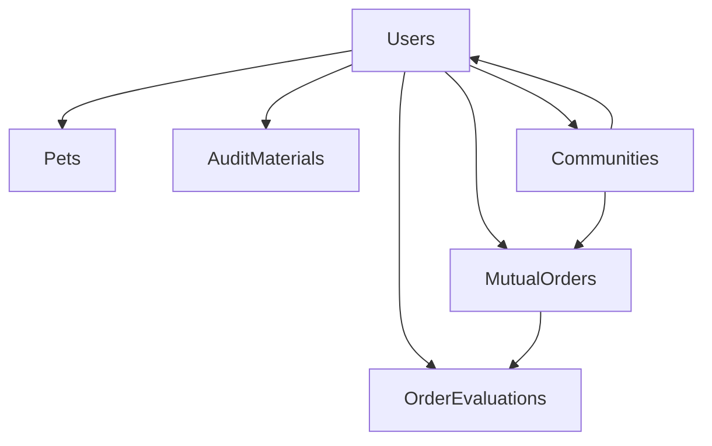

# 🐾 PetPal - 宠物互助平台 API

**基于ASP.NET Core的现代化宠物服务共享平台**

[](https://dotnet.microsoft.com/)
[](https://www.mysql.com/)
[](https://swagger.io/)

## 📋 目录

- [项目简介](#项目简介)
- [核心特性](#核心特性)
- [技术架构](#技术架构)
- [快速开始](#快速开始)
- [API 接口文档](#api-接口文档)
- [数据库设计](#数据库设计)
- [部署说明](#部署说明)

## 🎯 项目简介

PetPal 是专为宠物主人和服务提供者打造的互助服务平台。通过角色化设计，实现宠物照顾需求的精准匹配和高效服务。平台支持地理位置定位、订单评价体系、智能审核流程，确保服务质量和用户安全。

## 📈 最新更新

**v2.0.0 - 代码重构优化**
- ✅ **移除信誉系统**：完全移除基于积分的信誉评价，改为订单评分体系
- ✅ **简化密码管理**：统一使用手机号验证的重置密码接口
- ✅ **优化接口设计**：移除冗余接口，简化API结构
- ✅ **代码清理**：移除不再使用的模型和服务类

## ✨ 核心特性

- **🔐 三角色架构** - 宠物主人、服务者、管理员各司其职
- **📍 地理位置服务** - LBS定位，社区化本地服务匹配
- **⭐ 订单评价体系** - 1-5星评分，服务质量透明化
- **🔍 智能审核系统** - Sitter资质审核，保障服务质量
- **🛡️ 安全可靠** - JWT认证、数据脱敏、权限控制

## 🏗️ 技术架构

### 技术栈
- **后端框架**: ASP.NET Core 10.0 Web API
- **数据库**: MySQL 8.0+ (EF Core + Pomelo)
- **身份认证**: JWT Bearer Token + 角色权限
- **API文档**: Swagger/OpenAPI 自动生成
- **日志系统**: Serilog 结构化日志
- **缓存服务**: Redis (可选)

### 项目结构
```
petpal/
├── Controllers/          # API控制器（按功能分类）
│   ├── AuthController.cs      # 🔐 认证相关
│   ├── AdminController.cs     # 👨‍💼 管理员功能
│   ├── UserController.cs      # 👤 用户管理
│   ├── SitterController.cs    # 🐾 服务者功能
│   ├── CommunityController.cs # 🏘️ 社区查询
│   ├── RequestsController.cs  # 📋 需求发布
│   └── OrderRatingController.cs # 📦 订单评分
├── Services/            # 业务服务层
├── Models/              # 数据模型
├── Data/                # 数据访问层
└── Properties/          # 项目配置
```

## 🚀 快速开始

### 环境要求
- .NET 10.0.101 SDK
- MySQL 8.0+
- Redis (可选)

### 启动步骤

1. **克隆项目**
   ```bash
   git clone <repository-url>
   cd petpal
   ```

2. **配置数据库**
   ```bash
   # 编辑 appsettings.json
   # 设置 MySQL 连接字符串
   ```

3. **启动服务**
   ```bash
   dotnet run --urls "http://127.0.0.1:5002;https://127.0.0.1:5003"
   ```

4. **访问接口文档**
   - Swagger UI: http://127.0.0.1:5002/swagger
   - API 文档: http://127.0.0.1:5002/swagger/v1/swagger.json

## 📚 API 接口文档

### 🔐 通用说明

- **基础URL**: `http://127.0.0.1:5002/api/v1`
- **认证方式**: `Authorization: Bearer {token}`
- **响应格式**: JSON
- **状态码**: 200(成功), 400(参数错误), 401(未授权), 403(权限不足), 404(未找到), 500(服务器错误)

### 📤 响应格式

```json
{
  "success": true,
  "data": {},
  "message": "操作成功"
}
```

### 关于 DTO（数据传输对象）

所有对外响应已统一使用 DTO（Data Transfer Objects），后端不会直接返回数据库实体。DTO 只包含前端需要的字段，避免循环引用并减少暴露敏感信息。常用 DTO 包括 `UserDto`、`CommunitySimpleDto` 等。

### 🔑 AuthController - 认证接口

#### 用户注册
```http
POST /api/auth/register
```

**请求体:**
```json
{
  "username": "petlover123",
  "password": "password123",
  "phone": "13800138000",
  "email": "user@example.com",
  "role": "User"
}
```

**角色选项:**
- `User`: 宠物主人（默认）
- `Sitter`: 服务者
- `Admin`: 管理员

**响应示例:**
```json
{
  "success": true,
  "data": {
    "user": {
      "id": "user-guid-123",
      "username": "petlover123",
      "phone": "13800138000",
      "email": "user@example.com",
      "role": 0,
      "status": 0,
      "createdAt": "2024-01-01T10:00:00Z"
    },
    "token": "eyJhbGciOiJIUzI1NiIsInR5cCI6IkpXVCJ9..."
  },
  "message": "注册成功"
}
```

#### 用户登录
```http
POST /api/auth/login
```

**请求体:**
```json
{
  "account": "13800138000",
  "password": "password123"
}
```

**响应示例:**
```json
{
  "success": true,
  "data": {
    "token": "eyJhbGciOiJIUzI1NiIsInR5cCI6IkpXVCJ9...",
    "user": {
      "userId": "user-guid-123",
      "username": "petlover123",
      "role": "User"
    }
  },
  "message": "登录成功"
}
```

#### 重置密码（通过手机号验证）
```http
PUT /api/auth/reset-password
```

**请求体:**
```json
{
  "phone": "13800138000",
  "password": "newpassword123"
}
```

**响应示例:**
```json
{
  "success": true,
  "message": "密码重置成功，请使用新密码登录"
}
```

### 👤 UserController - 用户管理接口

#### 获取个人信息
```http
GET /api/user/profile
Authorization: Bearer {token}
```

**响应示例:**
```json
{
  "success": true,
  "data": {
    "userId": "user-guid-123",
    "username": "petlover123",
    "phone": "13800138000",
    "email": "user@example.com",
    "role": "User",
    "status": "Active",
    "isRealNameCertified": true,
    "isPetCertified": false,
    "createdAt": "2024-01-01T10:00:00Z",
    "lastLoginAt": "2024-01-01T14:30:00Z"
  },
  "message": "获取成功"
}
```

#### 更新个人信息
```http
PUT /api/user/profile
Authorization: Bearer {token}
```

**请求体:**
```json
{
  "username": "newusername",
  "phone": "13800138000",
  "email": "newemail@example.com"
}
```

**响应示例:**
```json
{
  "success": true,
  "message": "更新成功"
}
```

### 🐾 SitterController - 服务者接口

#### 获取可接单需求
```http
GET /api/requests/available?sitterId=user-guid-123
Authorization: Bearer {token}
```

**响应示例:**
```json
{
  "success": true,
  "data": [
    {
      "requestId": "req-guid-456",
      "ownerId": "owner-guid-789",
      "title": "帮我照顾金毛犬3天",
      "petType": "dog",
      "serviceType": "寄养",
      "startTime": "2024-01-15T09:00:00Z",
      "endTime": "2024-01-18T18:00:00Z",
      "description": "需要专业宠物护理",
      "distance": 2.5,
      "status": "Approved"
    }
  ],
  "message": "获取成功"
}
```

#### 接受需求
```http
POST /api/requests/accept/req-guid-456
Authorization: Bearer {token}
```

**响应示例:**
```json
{
  "success": true,
  "data": {
    "orderId": "order-guid-101",
    "requestId": "req-guid-456",
    "sitterId": "sitter-guid-123",
    "ownerId": "owner-guid-789",
    "status": "Accepted",
    "acceptedAt": "2024-01-01T14:30:00Z"
  },
  "message": "接单成功"
}
```

### 📋 RequestsController - 需求管理接口

#### 发布宠物服务需求
```http
POST /api/request/create
Authorization: Bearer {token}
```

**请求体:**
```json
{
  "petInfo": {
    "name": "旺财",
    "type": "dog",
    "breed": "金毛",
    "age": 2,
    "description": "活泼可爱"
  },
  "serviceType": "寄养",
  "startTime": "2024-01-15T09:00:00Z",
  "endTime": "2024-01-18T18:00:00Z",
  "description": "春节期间需要专业宠物寄养服务",
  "longitude": 116.4074,
  "latitude": 39.9042
}
```

**响应示例:**
```json
{
  "success": true,
  "data": {
    "requestId": "req-guid-456",
    "ownerId": "owner-guid-123",
    "petId": "pet-guid-789",
    "title": "帮我照顾金毛犬旺财3天",
    "status": "Pending",
    "createdAt": "2024-01-01T10:00:00Z"
  },
  "message": "需求发布成功，等待审核"
}
```

### 📦 OrderRatingController - 订单评分接口

#### 获取我的订单
```http
GET /api/order/my?userId=user-guid-123
Authorization: Bearer {token}
```

**响应示例:**
```json
{
  "success": true,
  "data": [
    {
      "orderId": "order-guid-101",
      "title": "帮我照顾金毛犬旺财3天",
      "petType": "dog",
      "serviceType": "寄养",
      "status": "Completed",
      "sitterInfo": {
        "userId": "sitter-guid-456",
        "username": "petsitter001",
        "reputationLevel": "靠谱"
      },
      "createdAt": "2024-01-01T10:00:00Z",
      "completedAt": "2024-01-04T18:00:00Z"
    }
  ],
  "message": "获取成功"
}
```

#### 提交订单评分
```http
POST /api/orders/{orderId}/rating
Authorization: Bearer {token}
```

**请求体:**
```json
{
  "evaluatedUserId": "sitter-guid-456",
  "evaluationType": "service_quality",
  "score": 5,
  "content": "服务非常专业，宠物照顾得很好！"
}
```

**响应示例:**
```json
{
  "success": true,
  "data": {
    "orderId": "order-guid-101",
    "evaluatorId": "owner-guid-123",
    "evaluatedUserId": "sitter-guid-456",
    "evaluationType": "service_quality",
    "score": 5,
    "content": "服务非常专业，宠物照顾得很好！",
    "createdAt": "2024-01-04T20:00:00Z"
  },
  "message": "评分提交成功"
}
```

#### 获取订单评分
```http
GET /api/orders/{orderId}/ratings
Authorization: Bearer {token}
```

**响应示例:**
```json
{
  "success": true,
  "data": [
    {
      "orderId": "order-guid-101",
      "evaluatorId": "owner-guid-123",
      "evaluatedUserId": "sitter-guid-456",
      "evaluationType": "service_quality",
      "score": 5,
      "content": "服务非常专业，宠物照顾得很好！",
      "createdAt": "2024-01-04T20:00:00Z"
    }
  ]
}
```

### 👨‍💼 AdminController - 管理员接口

#### 获取社区统计
```http
GET /api/admin/community/stats
Authorization: Bearer {admin-token}
```

**响应示例:**
```json
{
  "success": true,
  "data": {
    "totalMembers": 1250,
    "petOwners": 980,
    "sitters": 270,
    "pendingRequests": 15,
    "activeOrders": 45
  },
  "message": "获取成功"
}
```

#### 审核需求通过
```http
PUT /api/admin/requests/review/pass
Authorization: Bearer {admin-token}
```

**请求体:**
```json
{
  "requestId": "req-guid-456"
}
```

**响应示例:**
```json
{
  "success": true,
  "data": {
    "requestId": "req-guid-456",
    "status": "Approved",
    "reviewedAt": "2024-01-01T12:00:00Z",
    "reviewedBy": "admin-guid-001"
  },
  "message": "审核通过"
}
```

#### 审核需求拒绝
```http
PUT /api/admin/requests/review/reject
Authorization: Bearer {admin-token}
```

**请求体:**
```json
{
  "requestId": "req-guid-456",
  "reason": "资料不符合要求"
}
```

**响应示例:**
```json
{
  "success": true,
  "message": "需求已拒绝"
}
```

3. **快速启动（推荐）**
   使用提供的启动脚本自动完成所有设置：

```cmd
# 方法1：双击运行 start.bat 文件

# 方法2：在命令行中执行（推荐）：
.\start.bat

# 环境检查：
.\check-env.bat
```

3. **手动安装步骤**
   如果启动脚本遇到问题，可以手动执行以下步骤：

   - **安装依赖**
     ```bash
     dotnet restore
     ```

   - **配置数据库**
     - 确保MySQL服务器正在运行 (121.40.86.149:3306)
     - 修改 `appsettings.json` 中的连接字符串
     ```json
     "ConnectionStrings": {
       "DefaultConnection": "Server=121.40.86.149;Port=3306;Database=petpal;User Id=petpal;Password=Lele050522;SslMode=None;AllowPublicKeyRetrieval=True;Connection Timeout=30"
     }
     ```

   - **连接诊断**
     ```cmd
     # 运行详细的MySQL连接诊断
     .\test-mysql-connection.bat
     ```

   - **初始化MySQL数据库（推荐）**
     ```cmd
     # 使用提供的SQL脚本初始化数据库
     mysql -h 121.40.86.149 -P 3306 -u root -p < database-init.sql
     ```

   - **运行数据库迁移**
     ```cmd
     dotnet ef database update
     ```

   - **启动应用程序**
     ```cmd
     dotnet run
     ```

4. **访问API文档**
   - 打开浏览器访问: `http://127.0.0.1:5002` (Swagger UI)
   - 或者访问: `https://127.0.0.1:5003` (如果HTTPS可用)

## 📋 API接口文档

**接口设计说明：**
- 所有接口统一使用 `/api` 前缀
- 精细划分7个Controller，按功能模块组织
- AuthController：认证相关（注册、登录、验证码等）
- AdminController：管理员专用功能
- UserController：普通用户个人信息管理
- SitterController：服务者专用功能
- CommunityController：社区查询功能
- RequestsController：需求发布功能
- OrderRatingController：订单评分管理
- 接口格式：`请求方式 接口路径`

---

## 🔐 AuthController - 认证相关接口

### 用户认证
- `POST /api/auth/register` - 用户注册
- `POST /api/auth/login` - 用户登录
- `POST /api/auth/logout` - 退出登录
- `POST /api/auth/send-captcha` - 发送验证码
- `PUT /api/auth/reset-password` - 重置密码（通过手机号验证）

---

## 👨‍💼 AdminController - 管理员专用接口
### 社区管理
- `GET /api/admin/community/my` - 获取管理员所属社区
- `GET /api/admin/community/stats` - 获取社区统计
- `GET /api/admin/community/distribution` - 获取成员分布
- `GET /api/admin/community/activity` - 获取社区活跃度
- `GET /api/admin/community/members` - 获取社区成员列表
- `GET /api/admin/community/members/search` - 搜索社区成员
- `PUT /api/admin/community/members/role` - 修改成员角色
- `DELETE /api/admin/community/members/remove` - 移除社区成员
- `GET /api/admin/community/settings` - 获取社区设置
- `PUT /api/admin/community/settings` - 更新社区设置

### 需求审核管理
- `GET /api/admin/requests/review/list` - 获取审核列表
- `GET /api/admin/requests/review/detail/{id}` - 获取审核详情
- `PUT /api/admin/requests/review/pass` - 通过审核
- `PUT /api/admin/requests/review/reject` - 拒绝审核
- `PUT /api/admin/requests/review/recheck` - 重新审核

---

## 👤 UserController - 用户个人信息管理接口

### 用户信息管理
- `GET /api/user/profile` - 获取当前用户信息
- `PUT /api/user/profile` - 更新用户信息
- `DELETE /api/user/delete` - 注销账户

### 宠物管理
- `POST /api/user/pet/profile` - 创建宠物信息

### 评价管理
- `GET /api/user/reviews` - 获取评价列表

### 位置服务
- `POST /api/user/location` - 更新位置信息
- `GET /api/user/location` - 获取当前位置信息

---

## 🐾 SitterController - 服务者专用接口

### 服务者资质管理
- `GET /api/sitter/audit/status` - 获取审核状态
- `POST /api/sitter/audit/materials` - 提交审核资料
- `GET /api/sitter/audit/materials` - 获取已提交资料

### 接单管理
- `GET /api/sitter/requests/available` - 获取可接单需求
- `GET /api/sitter/requests/detail/{id}` - 查看需求详情
- `POST /api/sitter/requests/accept/{id}` - 接受需求
- `GET /api/sitter/location/distance` - 计算距离

### 订单管理
- `GET /api/sitter/orders/finished` - 获取已完成订单
- `GET /api/sitter/orders/feedback/{id}` - 查看评价
- `GET /api/sitter/user/reputation/{id}` - 获取用户信誉

### 服务者信息管理
- `GET /api/sitter/profile` - 获取个人信息
- `PUT /api/sitter/profile` - 更新个人信息

---

## 🏘️ CommunityController - 社区查询接口

### 社区信息查询
- `GET /api/community/my` - 获取所属社区
- `GET /api/community/find` - 根据位置查找社区
- `GET /api/community/services/{communityId}` - 获取社区服务
- `GET /api/community/services/nearby` - 获取附近服务

---

## 📋 RequestsController - 需求发布接口

### 需求发布
- `GET /api/requests/pet/types` - 获取宠物类型
- `GET /api/requests/service/categories` - 获取服务类型
- `POST /api/requests/create` - 发布宠物服务需求

---

## 📦 OrderRatingController - 订单评分接口

### 订单评分管理
- `POST /api/orders/{orderId}/rating` - 提交订单评分
- `GET /api/orders/{orderId}/ratings` - 获取订单评分列表

---

## 📝 接口通用说明

1. **路径参数**: `{id}` 为路径参数，需替换为实际的ID值
2. **请求体**: POST/PUT请求需携带JSON格式的请求体
3. **身份认证**: 所有接口需在请求头中携带JWT Token：`Authorization: Bearer {token}`
4. **响应格式**: 统一JSON格式 `{ success: bool, data: any, message: string }`
5. **角色权限**: 不同接口有对应的角色访问权限限制

## 🗄️ 数据库设计

### 📋 数据表概览

| 表名 | 说明 | 核心字段 |
|------|------|----------|
| **Users** | 用户主表 | 用户信息、角色、地理位置 |
| **Pets** | 宠物信息 | 宠物详情、疫苗记录 |
| **MutualOrders** | 互助订单 | 订单状态、服务时间、地理位置 |
| **OrderEvaluations** | 订单评价 | 评分内容、评价类型 |
| **AuditMaterials** | 审核材料 | Sitter资质文件 |
| **Communities** | 社区信息 | 社区范围、成员统计 |

### 🔗 核心关系图



### 📊 核心字段说明

#### Users（用户表）
- **基本信息**: `Id`, `Username`, `Phone`, `Email`, `Role`, `Status`
- **认证状态**: `IsRealNameCertified`, `IsPetCertified`
- **地理位置**: `Longitude`, `Latitude`, `CommunityId`
- **Sitter资料**: `CareIntroduction`, `ServiceTypes`, `QualificationDocuments`

#### MutualOrders（订单表）
- **订单信息**: `OwnerId`, `Title`, `Status`, `CreatedAt`
- **服务详情**: `PetType`, `ServiceType`, `StartTime`, `EndTime`
- **地理位置**: `Longitude`, `Latitude`, `CommunityId`

#### OrderEvaluations（订单评价表）
- **评价关系**: `OrderId`, `EvaluatorId`, `EvaluatedUserId`
- **评价内容**: `EvaluationType`, `Score`, `Content`, `CreatedAt`

### 🔢 枚举类型

| 枚举类型 | 值 | 说明 |
|----------|----|------|
| **UserRole** | User/Sitter/Admin | 用户角色 |
| **UserStatus** | Active/Inactive/Banned | 用户状态 |
| **OrderStatus** | Pending/Approved/Accepted/Completed | 订单状态 |
| **SitterAuditStatus** | NotApplied/Pending/Approved/Rejected | 审核状态 |

#### Communities（社区表）
| 字段名 | MySQL类型 | C#类型 | 说明 |
|--------|-----------|---------|------|
| Id | INT | int | 主键，社区ID（自增） |
| Name | nvarchar(100) | string | 社区名称（必填） |
| MinLng | decimal(9,6) | decimal | 社区范围最小经度 |
| MaxLng | decimal(9,6) | decimal | 社区范围最大经度 |
| MinLat | decimal(8,6) | decimal | 社区范围最小纬度 |
| MaxLat | decimal(8,6) | decimal | 社区范围最大纬度 |
| Description | nvarchar(500) | string | 社区描述 |
| CreatedAt | datetime | DateTime | 创建时间 |
| IsActive | bit | bool | 是否激活 |


### 枚举类型定义

#### UserRole（用户角色）
- 0 = User（普通用户/宠物主人）
- 1 = Sitter（服务提供者）
- 2 = Moderator（社区管理员）
- 3 = Admin（系统管理员）

#### UserStatus（用户状态）
- 0 = Active（活跃）
- 1 = Inactive（非活跃）
- 2 = Banned（被封禁）

## 🚀 部署说明

### 📋 环境要求
- **.NET**: 10.0.101 SDK
- **数据库**: MySQL 8.0+
- **缓存**: Redis (可选)

### ⚙️ 配置说明

1. **数据库连接** (`appsettings.json`):
   ```json
   {
     "ConnectionStrings": {
       "DefaultConnection": "Server=127.0.0.1;Database=petpal;User=root;Password=your_password;"
     }
   }
   ```

2. **JWT配置**:
   ```json
   {
     "Jwt": {
       "SecretKey": "your-secret-key-here",
       "Issuer": "petpal-api",
       "Audience": "petpal-client"
     }
   }
   ```

### 🏃‍♂️ 启动命令

```bash
# 开发环境
dotnet run --urls "http://127.0.0.1:5002;https://127.0.0.1:5003"

# 生产环境
dotnet publish -c Release
dotnet petpal.dll --urls "http://0.0.0.0:80"
```

### 📊 监控检查

- **健康检查**: `GET /health`
- **Swagger文档**: `http://127.0.0.1:5002/swagger`
- **数据库连接**: 检查EF Core迁移状态

---

## 📞 联系我们

- **项目主页**: [GitHub Repository]
- **问题反馈**: [Issues]
- **技术支持**: [Discussions]

---

**🎉 感谢使用 PetPal - 让宠物照顾变得更简单！**
